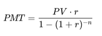

# Creditas Challenge
Aplicação Front-end, que permite simular valores de impréstimo, com base na idade.

Regras:
- Até 25 anos: 5% ao ano.
- De 26 a 40 anos: 3% ao ano.
- De 41 a 60 anos: 2% ao ano.
- Acima de 60 anos: 4% ao ano.

Fórmula que calcula valor de empréstimo:


- PMT = Pagamento mensal
- PV = Valor presente (empréstimo)
- r = Taxa de juros mensal (taxa anual / 12)
- n = Número total de pagamentos (meses)


## Índice
* [Execução da Aplicação](#execução-da-aplicação)
* [Execução de Testes](#execução-de-testes)
* [Estrutura de Pastas](#estrutura-de-pastas)
* [Tecnologias e Ferramentas Utilizadas](#tecnologias-e-ferramentas-utilizadas)
* [Estrutura do Projeto e Decisões de Arquitetura](#estrutura-do-projeto-e-decisões-de-arquitetura)
* [Melhorias Futuras](#melhorias-futuras)

## Execução da Aplicação
1 - Acessar pasta da aplicação:
```sh
$ cd creditas-challenge/
```

2 - Instalar o dependências:
```sh
$ npm install
```

3 - Abrir aplicação no navegador:
```sh
$ npm run dev
```

## Execução de Testes
1 - Comando para rodar todos os testes:
```sh
$ npm run test
```

2 - Comando para rodar todos os testes unitarios e integrados verificando cobertura:
```sh
$ npm run test:cov
```

3 - Comando para rodar todos os testes automatizados:

```sh
$ npm run cy:run
```
** aplicação deve estar rodando no navegador com `npm run dev`**

## Estrutura de Pastas
```
├── public/               # Arquivos estáticos
├── src/
│   ├── components/       # Componentes reutilizáveis
│   ├── styles/           # Estilos globais e tema
│   ├── utils/            # Funções auxiliares
│   ├── hooks/            # Hooks personalizados
│   ├── __tests__/        # Testes unitários e de integração
│   └── App.tsx           # Componente raiz
├── cypress/              # Testes end-to-end
│   ├── e2e/              # Casos de testes E2E
│   ├── support/          # Configurações globais dos testes
│   └── fixtures/         # Dados mockados para testes
```

## Tecnologias e Ferramentas Utilizadas
- [Trello](https://https://trello.com/);
- [TypeScript](https://www.typescriptlang.org/);
- [React](https://pt-br.reactjs.org/);
- [Jest](https://jestjs.io/);
- [Cypress](https://www.cypress.io/);
- [Vite](https://vite.dev//);
- [Styled Components](https://styled-components.com/);
- [Coolors](https://coolors.co/);
- [VisBug](https://chrome.google.com/webstore/detail/visbug/cdockenadnadldjbbgcallicgledbeoc);

## Estrutura do Projeto e Decisões de Arquitetura
- Componentização: Dividi a interface em componentes pequenos, com responsabilidades bem definidas.

- Separação de responsabilidades: Evitei misturar regras de negócio com componentes visuais. Algumas lógicas foram extraídas para arquivos auxiliares ou hooks, quando necessário.

- Styled Components: Usei styled-components para manter os estilos encapsulados dentro dos próprios componentes. Isso facilita a manutenção e evita conflitos de CSS.

- Testes: Usei Jest para testes unitários e de integração, principalmente para validar comportamentos de componentes e funções isoladas. Para simular o comportamento do usuário de ponta a ponta, utilizei Cypress nos testes E2E.

- Ferramentas visuais: Utilizei o VisBug como uma extensão no navegador para ajustar elementos visuais de forma rápida. Também usei o Coolors para montar uma paleta de cores agradável e consistente.

- Planejamento com Trello: Para organizar as tarefas e acompanhar meu progresso durante o desenvolvimento, utilizei o Trello. Isso me ajudou a manter foco e entender bem o que precisava ser feito em cada etapa.

- Vite: Escolhi o Vite como bundler pela velocidade no ambiente de desenvolvimento e pela integração simples com React e TypeScript.

## Melhorias Futuras
- Melhorias no design geral para garantir uma experiência mais fluida e agradável ao cliente.

- Suporte a diferentes temas como: claro e escuro, além de um modo com cores acessíveis, pensando em pessoas com daltonismo ou baixa visão.

- Adição de campo de e-mail para envio da simulação. O usuário poderia informar um endereço de e-mail para receber os resultados da simulação, facilitando o acesso posterior às informações e permitindo que ele compartilhe ou consulte os dados com mais comodidade.
